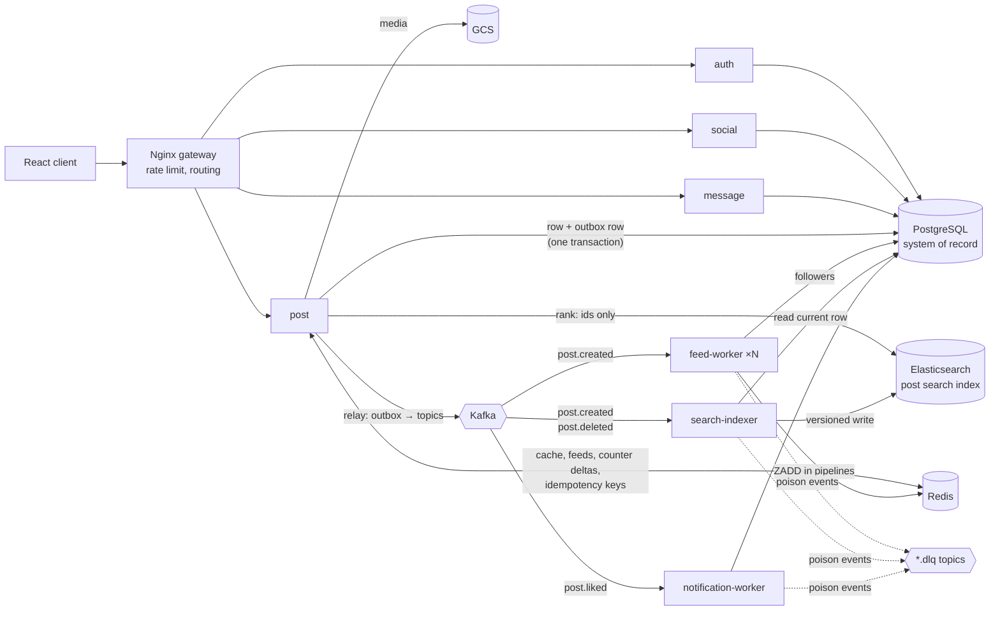
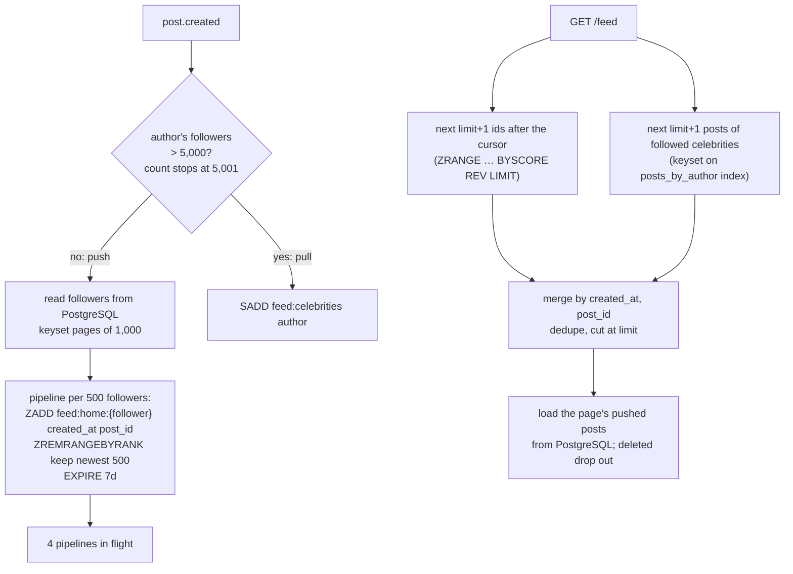
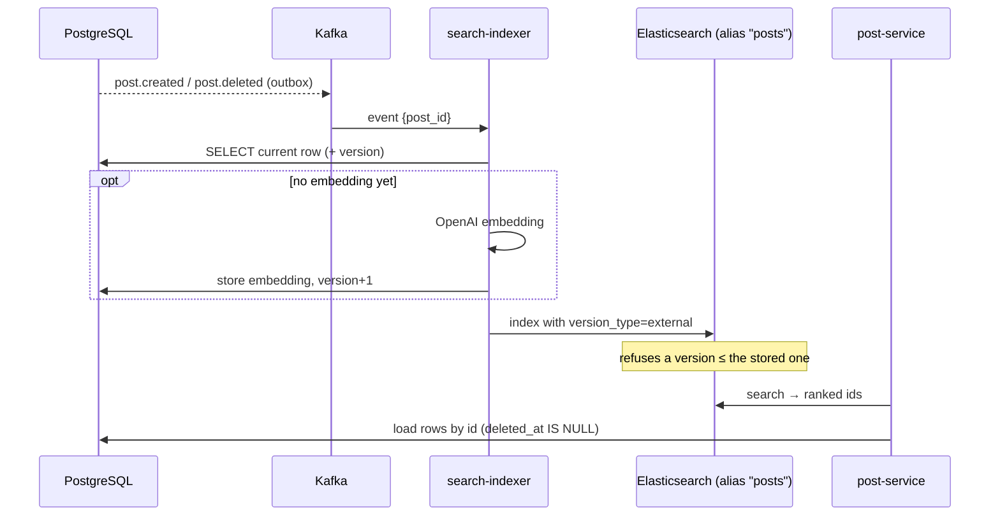
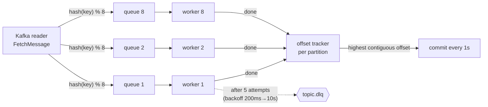

# Architecture

SocialAI is a set of Go services behind an Nginx gateway. **PostgreSQL is the system of
record.** Elasticsearch holds a search projection of posts that is rebuilt from PostgreSQL,
Redis holds caches, materialised feeds and counter deltas, and Kafka carries domain events
between services. This document explains the paths that must stay correct under failure and
concurrency, and why each is built the way it is. Every guarantee below is covered by a test
listed in [SCALING.md](SCALING.md#correctness-under-failure-and-concurrency). Why PostgreSQL
replaced Elasticsearch as the store is in [ADR 0001](adr/0001-postgres-system-of-record.md);
how existing data moves over is in [MIGRATION.md](MIGRATION.md). Known gaps are listed at the
end.



## 0. Who owns which data

One PostgreSQL database, one schema (`migrations/0001_init.sql`). Every table has exactly one
service that writes it; others may read it:

| Owner | Tables | Read by |
|---|---|---|
| auth | `users` | social, message (does the recipient exist?) |
| social | `follows` | feed-worker (followers to fan out to), post (followed celebrities) |
| post | `posts`, `post_likes`, `post_shares`, `comments`, `outbox` | search-indexer |
| message | `conversations`, `conversation_members`, `messages` | — |
| notification-worker | `notifications` | — |

Foreign keys only link tables with the same owner (a like references its post; a reply
references its parent comment). Cross-owner reads go through `shared/socialgraph`, a small
read-only package, so the day `follows` moves to its own database the readers change in one
place. Sharing a database is a deliberate, stated compromise — see the ADR.

Schema changes are SQL files applied by `cmd/migrate`, a one-shot job that runs before the
services (a compose service with `service_completed_successfully`). It holds a Postgres
advisory lock (two migrators never apply the same file twice), applies each file and its
`schema_migrations` row in one transaction (a failing file leaves nothing behind), and refuses
to start if an applied file was edited afterwards (checksum).

## 1. Creating a post: transactional outbox

**Problem.** Creating a post writes the database and then publishes `post.created` to Kafka.
The two cannot share a transaction; either can fail after the other succeeded: a post that
never reaches any feed, or an error for a post that exists, which the client retries into a
duplicate.

**Design.** The event is inserted into the `outbox` table in the **same transaction** as the
post (`outbox.Enqueue`). Both commit or neither does; a failure to record the event rolls the
post back (`TestSavePost_OutboxFailureRollsBackThePost`). Publishing happens afterwards:

```mermaid
sequenceDiagram
  participant H as post handler
  participant PG as PostgreSQL
  participant K as Kafka
  participant RL as outbox relay (each instance, every 2s)
  H->>PG: BEGIN; INSERT posts; INSERT outbox (due in 10s); COMMIT
  H->>K: publish post.created (fast path, ≤1s)
  alt Kafka accepts
    H->>PG: outbox.status = published
  else Kafka down
    H->>PG: attempts=1, next_attempt_at = now + backoff
    Note over H: request still returns 201
    RL->>PG: claim due rows: UPDATE … WHERE id IN (SELECT … FOR UPDATE SKIP LOCKED) — lease 2 min
    RL->>K: publish (5 s timeout each)
    RL->>PG: published, or retry later: 1s, 2s, 4s … capped at 5m
  end
```

- **Many relays, no double work.** Every post-service instance runs a relay. A pass *claims*
  due rows in one statement: `FOR UPDATE SKIP LOCKED` makes concurrent relays skip each
  other's rows instead of waiting or taking the same ones, and the claim pushes
  `next_attempt_at` forward by a lease. No transaction stays open while Kafka is called. If a
  relay dies after claiming, the lease expires and another relay takes the rows
  (`TestConcurrentRelaysPublishEachEventOnce`: 8 relays, 400 events, each published once;
  `TestClaimedRowsComeBackWhenTheLeaseExpires`).
- **At-least-once.** A crash between "published" and "marked" re-publishes; a pass slower than
  the lease can let a second relay publish a row too. Both are duplicates, which every consumer
  absorbs (sections 3, 5, 7). A broker outage of any length only delays events; parking rows as
  `dead` is opt-in (`Relay.MaxAttempts`).
- **Operability.** `outbox_pending`, `outbox_oldest_pending_seconds` and `outbox_dead` gauges
  (an outage shows up as a growing backlog, not as failures); published rows are pruned after
  7 days (`TestPruneKeepsRecentAndUnpublishedRows`).
- **CDC-ready.** Columns follow the Debezium outbox event router (`aggregate_type`,
  `aggregate_id`, `topic`, `payload`), so the polling relay could be replaced by log-based CDC
  without touching a single writer. Why polling for now: ADR 0001.
- **Ordering.** The relay publishes oldest first, but a row that fails is retried later while
  younger rows go out, so per-key order holds only when nothing fails. No consumer depends on
  it: feeds are scored by creation time, the indexer re-reads the current row, notification
  ids are deterministic.

`post.liked` and `post.deleted` go through the same outbox. `post.liked` used to be a
best-effort publish after the write, dropped whenever Kafka was down; now it is committed
with the like (`TestLikePost_KafkaDownNotificationIsDelayedNotLost`).

Upload keeps a compensating action for the one resource outside the database: if the
transaction fails, the uploaded GCS object is deleted (`TestSavePost_DatabaseDown_CompensatesGCS`).

## 2. Retries from clients: idempotency keys

`POST /upload` and `POST /post/generate-image-from-openai` are not naturally idempotent, and
image generation is slow (~10–30 s) and billed per call — exactly when mobile clients time
out and retry. Clients send `Idempotency-Key: <uuid>`:

| Situation | Response |
|---|---|
| first request | claim the key with `SET NX` (TTL 2 min), run, store the response (TTL 24 h) |
| retry while the first is still running | `409` — the handler is not run twice |
| retry after success | stored response replayed, header `Idempotent-Replayed: true` |
| retry after a failure | the claim was released; the retry runs normally |
| same key, different body | `422` |

Keys are scoped per user, and the request fingerprint (caption, file name, size / prompt) is
stored with the claim. The claim, the stored result and the work itself run on a context
detached from the HTTP request: the typical retry comes after the client gave up and
disconnected, and the first attempt must still finish and be recorded
(`TestUploadClientDisconnectThenRetryReplays`). If Redis is down the request is served without
protection and logged, favouring availability. Code: `shared/idempotency`, `withIdempotency`.

`POST /message` takes the same header but needs no Redis: the key is stored on the message
row under a unique index, checked after taking the conversation lock, so the key and the
message commit together (section 6).

## 3. Home feeds: hybrid push/pull fan-out



- **Round trips:** one pipeline per 500 followers. An author at the 5,000-follower threshold
  costs 10 round trips per post; above it, zero (pull).
- **Bounded reads:** push vs pull is decided by counting followers *up to* threshold+1
  (`SELECT count(*) FROM (… LIMIT 5001)`), a bounded index range scan whatever the real count.
- **Idempotent and ordered:** `ZADD` with the post id as member, scored by creation time.
- **Followed celebrities** are the celebrity set intersected with the reader's follows by one
  primary-key probe per celebrity (`follower_id = $1 AND followee_id = ANY($2)`).
- **Paging:** the cursor is `(created_at, post_id)`. Each source returns its own first
  `limit+1` items after the cursor, so the merged page can neither skip nor repeat a post,
  including when many posts share a second and for posts migrated without a creation time
  (they get the epoch and sort last). `TestGetHomeFeed_PagingNeverRepeatsOrSkips` pages
  through 32 posts, 4 at a time.

## 4. Likes: the primary key is the check, the count is write-behind

**De-duplication.** `post_likes` has primary key `(post_id, user_id)`. A like is one
`INSERT … ON CONFLICT DO NOTHING`; concurrent double taps race on it and exactly one inserts a
row (`TestLikePost_ConcurrentDoubleTapCountsOnce`: 20 concurrent likes → 1 row, 1 event,
count +1). The Redis `like_set` and the Elasticsearch `op_type=create` of the old design are
gone: one source of truth instead of two that could disagree. Unlike is a `DELETE`.

**Hot row.** Incrementing `posts.like_count` in the like's transaction would make every like
of a viral post queue on that row's lock. Instead a like is `INCRBY cnt:like_count:{post}` +
`SADD cnt:dirty` in Redis; every 2 s a flusher `SPOP`s dirty posts, `GETDEL`s each delta and
applies it as **one** `UPDATE`. 1,000 likes inside a window → 1 row write per post-service
instance (`TestThousandConcurrentLikesBecomeOneWrite`). Failed calls put the delta back; on
SIGTERM the flusher finishes what it took and flushes once more
(`TestShutdownDuringFlushLosesNothing`). If Redis did not take the increment, the row is
updated directly, never both (`TestIncrThatCannotScheduleIsUndone`).

**Drift repair.** A crash between taking a delta out of Redis and applying it loses that delta.
The rows are the truth, so a reconciler walks `posts` in keyset batches, recounts
`post_likes`/`post_shares`, and rewrites a count only when the post is quiet (no like or
share for 5 minutes) and Redis holds no unflushed delta for it — otherwise a like committed a
moment ago would be counted by the recount *and* by its flush. The `UPDATE` is conditional on
the counts it read, so a flush landing in between wins (`TestReconcilerRepairsDriftedQuietPosts`).
Metric: `post_counters_repaired_total`.

## 5. Search: Elasticsearch is a projection



- **Reads.** Keyword and semantic search ask Elasticsearch for ranked ids only, then load the
  rows from PostgreSQL. A lagging index can therefore rank results, but never show a deleted
  post or a stale like count (`TestSearchPostByKeywords_HydratesFromTheDatabase`). Listing the
  newest posts and a user's posts no longer touch Elasticsearch at all.
- **Events say *which* post, not *what*.** The indexer reads the row's current state and writes
  it with `posts.version` as an external version. Redeliveries are refused as "already
  indexed", a late `post.created` after a delete reads the deleted row, and a write carrying an
  older version can never overwrite a newer one (`TestRedeliveryIsANoOp`,
  `TestLateCreatedEventCannotResurrectADeletedPost`, `TestStaleWriteIsRefusedByVersion`).
- **Tombstones, not deletes.** A deleted post is indexed as `deleted: true` and filtered out.
  Elasticsearch forgets the version of a *deleted* document after `index.gc_deletes` (60 s), so
  a delete followed by a late, redelivered create would bring the post back.
- **Embeddings off the request path.** Uploads used to call OpenAI for an embedding before
  answering. The indexer computes it, stores it in PostgreSQL (a rebuild never pays twice) and
  bumps the version so the richer document is accepted. If OpenAI fails, the post is indexed
  without a vector (keyword search works) and a repair loop retries every 5 minutes — an AI
  outage must not push events into the dead-letter topic
  (`TestOpenAIOutageIndexesWithoutVectorAndRepairsLater`).
- **Rebuildable.** Readers and the indexer use the alias `posts`. `cmd/reindex` re-syncs every
  row; `cmd/reindex -new-index posts_v2` builds a new index with a new mapping, moves the alias
  atomically, then runs a catch-up pass for posts changed during the build
  (`TestReindexRebuildsEverything`). The mapping is `dynamic: strict`: fields cannot appear in
  the index by accident.

The kNN request itself was also wrong before: the body used a `knnQuery` key, which is not
part of the Elasticsearch 8 search API; it now uses the top-level `knn` section with a filter.

## 6. Messages: conversations ordered by a per-conversation sequence

```text
conversations        (conversation_id PK, last_seq, last_message_at)          "dm:alice:bob"
conversation_members (conversation_id, user_id) PK, last_read_seq, last_message_at
messages             (conversation_id, seq) PK, sender_id, content, created_at, client_msg_id
```

The old design stored flat documents, fetched a conversation with an `OR` of two term queries
(returning at most 10 hits, the search default), and sorted them in memory.

- **Clustered by conversation.** A conversation's messages are one contiguous range of the
  primary key; every read (`newest N`, `before_seq`, `after_seq`) is one index range scan.
- **Why `seq` and not `created_at` as the paging key.** Two senders' transactions can commit
  in the opposite order of their timestamps. A client polling "messages after the last
  `created_at` I saw" would skip the one that committed late. `seq` is taken from
  `conversations.last_seq` under the row lock (`SELECT … FOR NO KEY UPDATE`), so it is gap-free
  and increases in commit order; `created_at` uses `clock_timestamp()` after the lock, so it
  never decreases as `seq` grows (`TestConcurrentSendersGetGapFreeCommitOrderedSeqs`: 100
  concurrent sends in both directions into a new conversation → seq 1..100).
- **Idempotent sends.** The `Idempotency-Key` is stored as `client_msg_id` (unique per
  conversation and sender) and checked after the lock, so ten concurrent retries store one
  message and all get it back (`TestConcurrentRetriesStoreOneMessage`).
- **Inbox.** `conversation_members` carries a copy of `last_message_at`, so a user's inbox is
  one range scan of `(user_id, last_message_at DESC)`; unread = `last_seq − last_read_seq`. The
  read marker only moves forward and never past the last message (`TestInboxUnreadAndMarkRead`).
- **Scale path.** The id is deterministic and every query filters on `conversation_id` first,
  so `messages` can be hash-partitioned by conversation (Postgres declarative partitioning, or
  a wide-column store) without changing the access pattern.

## 7. Consuming events: at-least-once, ordered per key, parallel

`shared/consumer` replaces a loop that retried three times without delay and then **committed
the offset anyway**, silently dropping the event.



- **Per-key order, cross-key parallelism.** The producer partitions by the outbox row's key
  (author id for post events); the consumer routes by the same key to one of 8 workers.
- **In-order commits.** Workers finish out of order; the tracker commits only the highest
  offset below which everything is done, so a crash never skips an unfinished message.
- **Backpressure.** Worker queues are bounded; when workers fall behind, fetching blocks.
- **Poison messages.** After the retry budget the message goes to `<topic>.dlq` with its
  origin, error and attempt count, and only then is the offset committed.
- **Idempotent handlers.** Feed: `ZADD`. Search: external versions. Notifications:
  deterministic id + `ON CONFLICT DO NOTHING`, so a redelivery neither notifies twice nor
  flips a read notification back to unread.
- **Scaling out.** `docker compose up --scale feed-worker=3`: the consumer group splits the
  topic's partitions between instances.

## 8. Reads: cache stampede protection

A user's post list is cached for 10 s. When a hot key expires, every concurrent request used
to miss and hit the store. Misses are **single-flighted** per instance (one query, the result
shared with everyone waiting; the query runs on a context detached from any one caller, so
the first caller hanging up does not fail the others) and TTLs are **jittered ±20 %**
(`TestSearchPostByUserId_ConcurrentMissesShareOneQuery`: 50 concurrent misses, ≤ 2 queries).

## 9. Correctness fixes found on the way

| Issue | Effect | Fix |
|---|---|---|
| Sign-up searched for the id, then wrote the document | two concurrent sign-ups both succeeded; the second replaced the first user's password | primary key + `ON CONFLICT DO NOTHING` (`TestAddUser_ConcurrentSignupsOneWinner`) |
| Follow searched, then indexed under a random id | a double click stored the relationship twice | primary key `(follower_id, followee_id)` (`TestAddFollow_ConcurrentDoubleClickStoresOneRow`) |
| Searches without a size | followers, following, conversations and a user's posts were silently cut at 10 (the ES default) | keyset-paged lists with `next_cursor` (`TestFollowers_PagesThroughEveryone`) |
| Follow accepted any id | following a user that does not exist | existence check → 404 |
| Unknown user at sign-in | returned faster than a wrong password (no bcrypt) | compare against a dummy hash |
| kNN body used `knnQuery` | not an Elasticsearch 8 search parameter | top-level `knn` with a filter |
| `KafkaProducer` wrote a shared map from concurrent handlers without a lock | `fatal error: concurrent map writes` under load | mutex |
| kafka-go `BatchTimeout` default (1 s) on synchronous writes | up to ~1 s added to requests that publish | 10 ms |
| No graceful shutdown | rolling deploys cut in-flight requests | `http.Server.Shutdown` on SIGTERM, wait for background loops, final counter flush |
| `docker-compose.yml` depended on a non-existent `openai` service; Kafka listener line was malformed | `docker compose up` refused to start | fixed; CI runs `docker compose config` |
| Dockerfiles used Go 1.21/1.23 for a Go 1.25 module and forced `GOARCH=amd64` | builds fail; images don't run natively on Apple Silicon | Go 1.25, native arch |
| CD workflow used `secrets` in a job-level `if` | every push showed a failed CD run | manual `workflow_dispatch` with an explicit check |
| Runtime images had no CA bundle | HTTPS calls (OpenAI, GCS) fail certificate verification | CA bundle in every image that calls out |

## 10. Known gaps

Stated so nobody has to discover them:

- **Shared database.** Services own tables, not databases. A slow query in one service can
  hurt the others, and a schema change is a coordinated deploy. The exit path is in ADR 0001.
- **Upload idempotency lives in Redis, not in the post's transaction.** If the post commits and
  storing the response in Redis fails, a retry after the 2-minute lock can create a second
  post. Moving the key into PostgreSQL (claimed in its own transaction, completed in the
  post's) would close it; `POST /message` already works that way.
- **Idempotency release** deletes the key without checking it still holds its own claim; a
  compare-and-delete (Lua) would close this.
- **Relay ordering** is per key only while nothing fails (section 1). A consumer that needs
  strict order would require the relay to hold back a key's younger rows behind a failed one.
- **New follows do not backfill the follower's feed** with the followee's earlier posts.
- **Consumer rebalance:** after partitions move, an instance may commit an old offset for a
  partition it no longer owns. That can only cause redelivery (absorbed), never loss.
- **Reindex writes one document per request.** Fine at this size; the bulk API is the next step
  for millions of posts.
- **Not load-tested yet:** see [SCALING.md](SCALING.md); no latency or throughput figure is
  claimed until the k6 run in `loadtest/` has been done.
