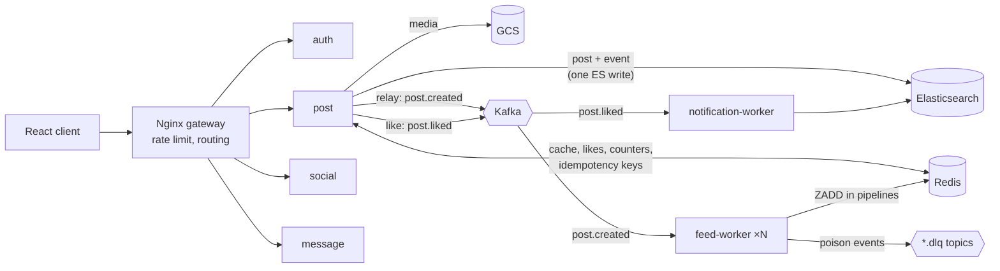
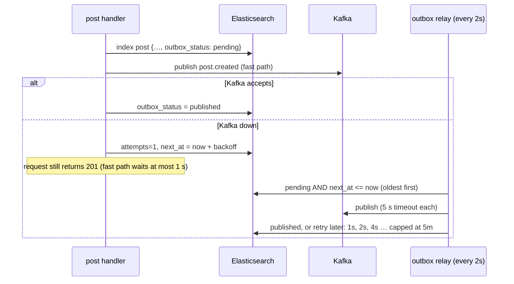
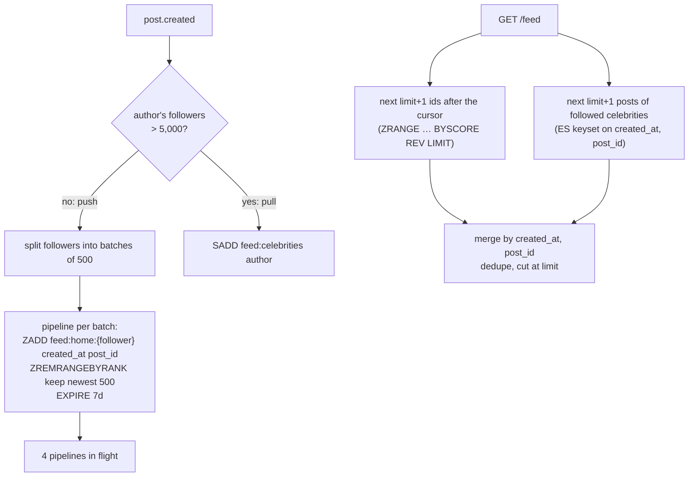
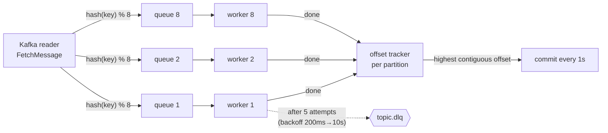

# Architecture

SocialAI is a set of Go services behind an Nginx gateway. Elasticsearch is the system of
record, Redis holds caches, feeds and counters, Kafka carries domain events between services.
This document explains the write paths that must stay correct under failure and concurrency,
and why each is built the way it is. Every guarantee below is covered by a test listed in
[SCALING.md](SCALING.md#correctness-under-failure-and-concurrency). Known gaps are listed at the end.

## 1. Creating a post: transactional outbox

**Problem.** Creating a post writes to Elasticsearch and then publishes `post.created` to
Kafka. The two cannot share a transaction. Before this change:

- ES succeeded and Kafka failed → the handler returned 500, although the post existed. The
  client retried and created a **duplicate post**; the original never reached any feed.
- Posts created by AI image generation were **never published** at all.

**Design.** The event is stored inside the post document (`outbox_status: pending`). A single
Elasticsearch document write is atomic, so the post and its event can no longer diverge.
Publishing happens afterwards:

Delivery is **at-least-once**: a crash between "published" and "marked" re-publishes. That is
safe because every consumer is idempotent (sections 3 and 5). By default a record is never
given up on: a broker outage of any length only delays events (retries back off to one every
5 minutes). Parking records as `dead` after N attempts is opt-in (`Relay.MaxAttempts`). A
shutdown in the middle of a pass does not count as a failed attempt. Code: `shared/outbox`,
`services/post/service/outbox_store.go`.

**Trade-off.** Polling ES every 2 s adds a small read load and up to ~2 s delay in the failure
case only; the common case publishes inline. A relational store would use a separate outbox
table in the same transaction; with a document store the aggregate itself carries the event.

## 2. Retries from clients: idempotency keys

`POST /upload` and `POST /post/generate-image-from-openai` are not naturally idempotent, and
image generation is slow (~10–30 s) and billed per call — exactly when mobile clients time
out and retry. Clients send `Idempotency-Key: <uuid>`:

| Situation | Response |
|---|---|
| first request | claim the key with `SET NX` (TTL 2 min), run, store the response (TTL 24 h) |
| retry while the first is still running | `409` — the handler is not run twice |
| retry after success | stored response replayed, header `Idempotent-Replayed: true` |
| retry after a failure | the claim was released; the retry runs normally |
| same key, different body | `422` |

Keys are scoped per user, and the request fingerprint (caption, file name, size / prompt) is
stored with the claim. The claim, the stored result and the image generation itself run on a
context detached from the HTTP request: the typical retry comes after the client gave up and
disconnected, and the first attempt must still finish and be recorded, or the retry would see
`409` for two minutes and then run the work a second time (test:
`TestUploadClientDisconnectThenRetryReplays`). If Redis is down the request is served without
protection and logged, favouring availability. Code: `shared/idempotency`, `withIdempotency`
in the post handler.

## 3. Home feeds: hybrid push/pull fan-out

**Before:** for each new post, feed-worker read up to 10,000 followers (**followers beyond
10,000 silently got nothing**) and made three sequential Redis calls per follower
(`LPUSH`, `LTRIM`, `EXPIRE`) — 30,000 round trips for a 10k-follower account. `LPUSH` also
duplicated entries when an event was redelivered, and nothing read the feed.

**Now** (`shared/feedplan`, `services/feed/worker`, `GET /feed`):

- **Round trips:** one pipeline per 500 followers. An author at the 5,000-follower threshold
  costs 10 round trips per post instead of 15,000; above it, zero (pull).
- **Idempotent:** `ZADD` with the post id as member — a redelivered event changes nothing.
- **Ordered:** the score is the post's creation time, so out-of-order delivery still sorts right.
- **Celebrities:** pushing one post into millions of feeds is the classic fan-out hot spot.
  Above the threshold the author is served by pull: readers fetch that author's recent posts
  and merge them in. The threshold is a knob (`feedplan.Policy`).
- **Paging:** the cursor is `(created_at, post_id)`. Each source returns its own first
  `limit+1` items after the cursor (Redis reads only that window; ES filters on the pair and
  sorts by both fields), so the merged page can neither skip nor repeat a post, including when
  many posts share a second and for old posts that have no `created_at`. Only the page's
  pushed ids are loaded from ES. Test: `TestGetHomeFeed_PagingNeverRepeatsOrSkips` pages
  through 32 posts, 4 at a time.

## 4. Likes: atomic de-duplication and a write-behind counter

**Race (fixed).** The old path was check-then-act: "is the user in `like_set`?" → "is there a
like document?" → write the like → increment `like_count`. Two concurrent requests from the
same user (double tap) both passed the checks and both incremented.

**Now** the check *is* the write:

1. `SADD like_set:{post} user` returns 1 only for the first caller → others get `409`.
2. The like document is created with `op_type=create`; Elasticsearch rejects a second one.
   This is the durable check when Redis has lost the set.
3. If step 2 fails, step 1 is undone (`SREM`) so the user can retry.

**Hot document (fixed).** Each like used to run an update-by-script on the post document.
Elasticsearch serialises updates per document with optimistic versioning, so a viral post's
concurrent updates conflict and retry (`RetryOnConflict(3)`), and eventually fail with 500
even though the like was stored. Now a like is `INCRBY cnt:like_count:{post}` + `SADD
cnt:dirty` in Redis; every 2 s a flusher `SPOP`s dirty posts, `GETDEL`s each delta and applies
it as **one** ES update. 1,000 likes inside a window → 1 ES write per post-service instance
(test: `TestThousandConcurrentLikesBecomeOneWrite`). Failed ES or Redis calls put the delta or
the dirty marker back. On SIGTERM the flusher finishes what it already took, the process
waits for it, then flushes once more (`TestShutdownDuringFlushLosesNothing`). If recording a
like in Redis fails halfway, the increment is undone and written to ES directly, never both
(`TestIncrThatCannotScheduleIsUndone`).

Trade-offs: counts in ES lag by up to one flush interval. A process crash (not a clean
shutdown) after `SPOP`/`GETDEL` and before the ES update loses that delta. The like documents
stay the source of truth, so the count can be recomputed from them; that reconcile job is
**not written yet**. Notification events for likes are best-effort (a Kafka error is logged,
not returned: the like itself is already durable).

## 5. Consuming events: at-least-once, ordered per key, parallel

`shared/consumer` replaces a loop that retried three times without delay and then **committed
the offset anyway**, silently dropping the event.

- **Per-key order, cross-key parallelism.** The producer partitions by author id (`Hash`
  balancer; it previously used `LeastBytes`, which spread one author's events over
  partitions). The consumer routes by the same key to one of 8 workers.
- **In-order commits.** Workers finish out of order; the tracker commits only the highest
  offset below which everything is done, so a crash never skips an unfinished message.
- **Backpressure.** Worker queues are bounded; when workers fall behind, fetching blocks.
- **Poison messages.** After the retry budget the message goes to `<topic>.dlq` with its
  origin, error and attempt count, and only then is the offset committed. If the DLQ itself is
  unavailable, nothing is committed past it.
- **Idempotent handlers.** Feed: `ZADD`. Notifications: deterministic id
  `like:{post}:{liker}`, so a redelivery overwrites instead of notifying twice.
- **Scaling out.** `docker compose up --scale feed-worker=3`: the consumer group splits the
  topic's partitions between instances (compose creates topics with 6 partitions; more
  instances than partitions would sit idle).

## 6. Reads: cache stampede protection

`SearchPostByUserId` caches for 10 s. When a hot key expires, every concurrent request used to
miss and query Elasticsearch. Misses are now **single-flighted** per instance (one query, the
result shared with everyone waiting) and TTLs are **jittered ±20 %** so keys written together
don't expire together. Test: `TestSearchPostByUserId_ConcurrentMissesShareOneQuery` — 50
concurrent misses, at most 2 ES queries.

Search responses also stopped returning the 1,536-float embedding of every post (roughly
15–20 KB of JSON per post): it is excluded by the Elasticsearch source filter.

## 7. Smaller correctness fixes found on the way

| Issue | Effect | Fix |
|---|---|---|
| `KafkaProducer` wrote a shared map from concurrent handlers without a lock | `fatal error: concurrent map writes` under load | mutex |
| kafka-go `BatchTimeout` default (1 s) on synchronous writes | up to ~1 s added to requests that publish | 10 ms |
| Delete and cleanup re-wrote the whole post document read earlier | could overwrite a like count changed in between (lost update) | partial updates (`UpdateFieldsInES`) |
| `docker-compose.yml` depended on a non-existent `openai` service; Kafka listener line was malformed | `docker compose up` refused to start | fixed; `docker compose config` validates |
| Dockerfiles used Go 1.21/1.23 for a Go 1.25 module and forced `GOARCH=amd64` | builds fail; images don't run natively on Apple Silicon | Go 1.25, native arch |
| CD workflow used `secrets` in a job-level `if` | every push showed a failed CD run | manual `workflow_dispatch` with an explicit check |
| No graceful shutdown | rolling deploys cut in-flight requests | `http.Server.Shutdown` on SIGTERM, wait for background loops, final counter flush |
| Runtime images had no CA bundle | HTTPS calls (OpenAI, GCS) fail certificate verification | CA bundle copied from the build stage |

## 8. Known gaps

Stated so nobody has to discover them:

- **Like-count reconcile job** (recount from `post_like`) is described above but not written.
- **Consumer rebalance:** after partitions move to another instance, this instance may still
  commit an old offset for a partition it no longer owns. That can only cause redelivery
  (duplicates, which handlers absorb), never loss; clearing tracker state on reassignment
  would remove it.
- **Idempotency release** deletes the key without checking it still holds its own claim; if
  a request outlives the 2-minute lock, its release could drop a newer request's claim.
  A compare-and-delete (Lua) would close this.
- **Upload fingerprint** uses caption, file name and size, not a hash of the content.
- **Not load-tested yet:** see [SCALING.md](SCALING.md); no latency or throughput figure is
  claimed until the k6 run in `loadtest/` has been done.
