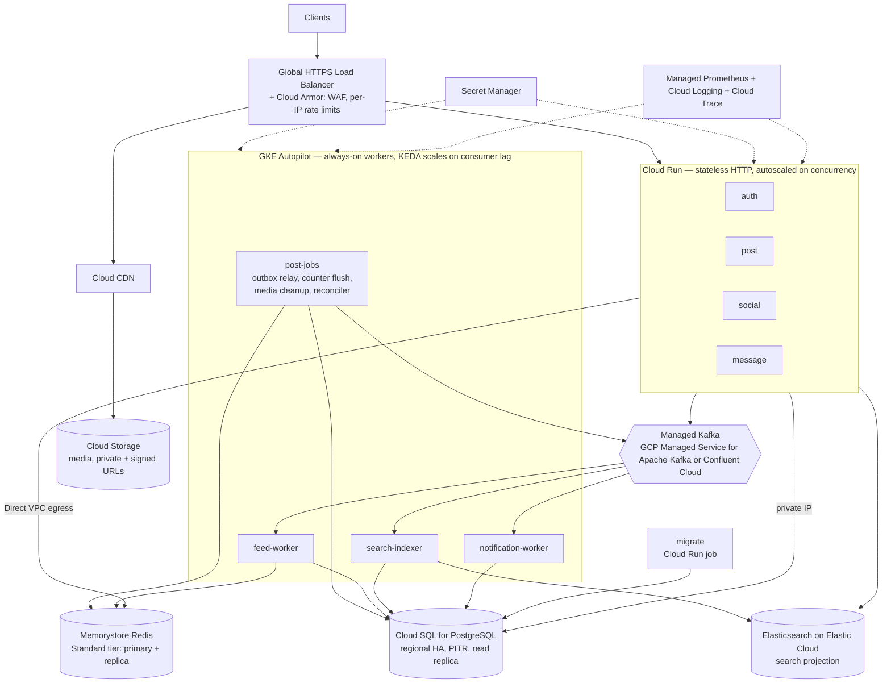

# Cloud architecture (target design for GCP)

> Status: design. The repository runs locally with `docker compose`; nothing here is
> deployed. GCP is chosen because the code already uses Cloud Storage and the CD workflow
> targets GCP.

## Why this split

| Component | Runs on | Reason |
|---|---|---|
| auth, post, social, message | Cloud Run | Stateless request/response; scales to zero off-peak, per-request autoscaling on bursts. `post` keeps `min-instances ≥ 1` to avoid cold starts on uploads. |
| outbox relay, counter flusher, media cleanup, count reconciler | `post-jobs` deployment on GKE (1–2 replicas) | They are loops, not requests. On Cloud Run with request-based billing the CPU is throttled between requests, so the loops would stall. Running them as their own deployment also lets the API scale without multiplying pollers. |
| feed-worker, search-indexer, notification-worker | GKE Autopilot + KEDA Kafka scaler | Pull-based consumers need to run continuously. KEDA scales replicas on consumer-group lag, capped at the partition count (extra consumers in a group would sit idle). |
| Kafka | Managed (GCP Managed Service for Apache Kafka, or Confluent Cloud) | Replication factor 3 across zones, `acks=all` (the producer already requires it). `post.created`: 12 partitions keyed by author id. |
| PostgreSQL | Cloud SQL, regional (HA) instance | System of record. Synchronous standby in a second zone (automatic failover), point-in-time recovery from WAL, a read replica for heavy reads. Connections go through a pooler (PgBouncer, or Cloud SQL's managed connection pooling where the edition offers it), because Cloud Run instances × pool size can otherwise exceed `max_connections`. |
| Redis | Memorystore, Standard tier | Automatic failover. Holds feeds, caches, idempotency keys (24 h) and unflushed counter deltas — all rebuildable or repairable from PostgreSQL. RDB snapshots keep failover losses to seconds of deltas, which the reconciler repairs anyway. |
| Elasticsearch | Elastic Cloud on GCP | Post search projection only (BM25 + kNN), rebuildable with `cmd/reindex`; 1 replica per shard so a zone loss keeps search up. Could be replaced by pgvector at this scale (ADR 0001). |
| Media | Cloud Storage + Cloud CDN | Objects stay private; the API issues signed URLs, the CDN serves repeated reads. |

## Scaling knobs and what they protect

| Knob | Protects | Starting value |
|---|---|---|
| Cloud Run `max-instances` × pgx pool size | PostgreSQL from connection storms | ≤ the pooler's client limit; the pooler holds a few dozen server connections |
| Cloud Run `max-instances` for post | Elasticsearch from search bursts | sized so instances × ES client pool ≤ ES capacity |
| Cloud Run concurrency | tail latency per instance | 40–80 requests/instance |
| Kafka partitions | consumer parallelism ceiling | 12 (feed-worker replicas ≤ 12, 8 keyed workers each) |
| `feedplan.Policy.CelebrityThreshold` | fan-out cost of a single post | 5,000 followers |
| Counter flush interval | row-update rate on hot posts | 2 s |
| Outbox relay batch / lease | duplicate publishes during slow passes | 20 rows, 2 min lease |
| Cloud Armor rate rules | abuse and retry storms at the edge | per-IP limits mirroring the Nginx `limit_req` config |

## Failure modes

| Failure | Behaviour |
|---|---|
| Kafka unavailable | Uploads, likes and deletes still succeed. Their events wait in the outbox table and are published when Kafka returns (`outbox_oldest_pending_seconds` shows the backlog). Feeds, search and notifications lag; nothing is lost. |
| PostgreSQL failover | Cloud SQL promotes the standby (on the order of a minute; measure it with a failover drill). Writes fail meanwhile and clients retry (uploads and messages with their Idempotency-Key). Committed rows and their outbox events survive; nothing in Redis or Elasticsearch needs repair. |
| Elasticsearch unavailable | Only search fails. Feeds, posts, likes and messages are unaffected; the indexer retries and catches up, or `cmd/reindex` rebuilds the index. |
| Redis failover | Caches and feeds refill; idempotency is skipped for requests in the failover window (logged); counter deltas not yet flushed can be lost and the reconciler recounts them from `post_likes`/`post_shares`. |
| A feed-worker crashes mid-batch | Its offsets were not committed; another instance re-processes. `ZADD` makes the repeat harmless. |
| Poison event | Moved to `post.created.dlq` after 5 attempts; alert on `consumer_dead_letters_total > 0`. |
| Zone outage | Cloud Run, GKE Autopilot, Memorystore Standard, Elastic Cloud and managed Kafka are all multi-zone within the region. |
| Region outage | Not covered by this design (single region). Next step: a cross-region Cloud SQL replica to promote, and rebuilding search and feeds from it in the standby region. |

## Delivery pipeline

1. GitHub Actions CI: `gofmt`, `go vet`, `go build`, `go test -race`.
2. On `main`: build one image per service, push to Artifact Registry, tagged with the commit SHA.
3. Authenticate with **Workload Identity Federation** (no long-lived JSON keys in GitHub secrets).
4. Run the `migrate` Cloud Run job; a failure stops the pipeline before any service changes.
   Migrations must be backward compatible with the running version (expand, deploy, contract),
   since old and new revisions run side by side during the traffic shift.
5. Cloud Run: deploy a new revision with no traffic, run a smoke test against its tagged URL,
   then shift traffic 10 % → 50 % → 100 %; roll back by moving traffic to the previous revision.
6. GKE workers: rolling update. SIGTERM triggers the graceful shutdown already in the code
   (in-flight messages finish; offsets of finished messages are committed; counters flushed).

## Observability

- Metrics: the services already expose Prometheus metrics (`/metrics`); Google Cloud Managed
  Service for Prometheus scrapes them without running Prometheus. Key alerts: p95 latency per
  route, `outbox_publish_lag_seconds` p95 > 30 s (with the default settings an outage shows up
  as growing lag, since records are never parked), `consumer_dead_letters_total`,
  consumer-group lag.
- Logs: structured JSON (zap) to Cloud Logging instead of the self-hosted ELK stack.
- Tracing (next step): OpenTelemetry with the trace context stored in the outbox row and
  propagated in Kafka headers, so one trace covers upload → outbox → fan-out and indexing.
